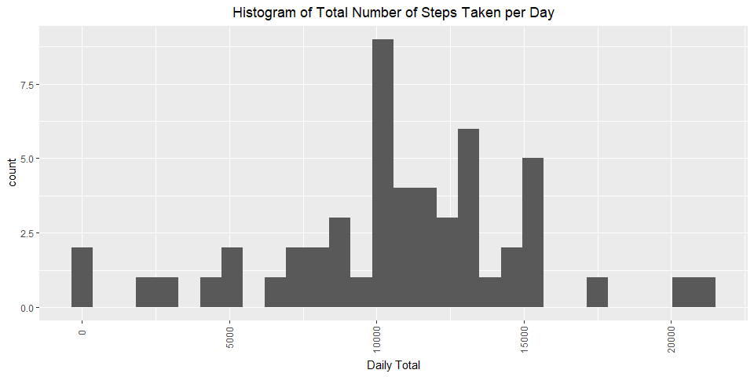
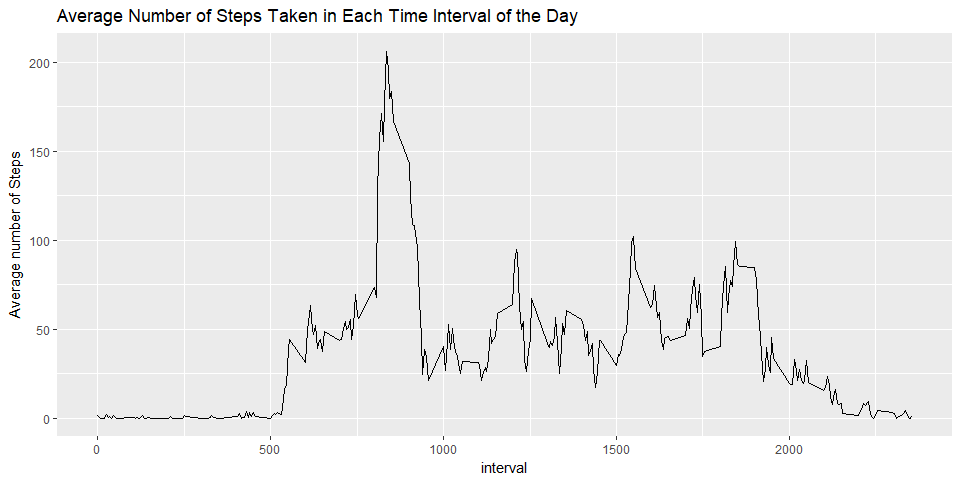
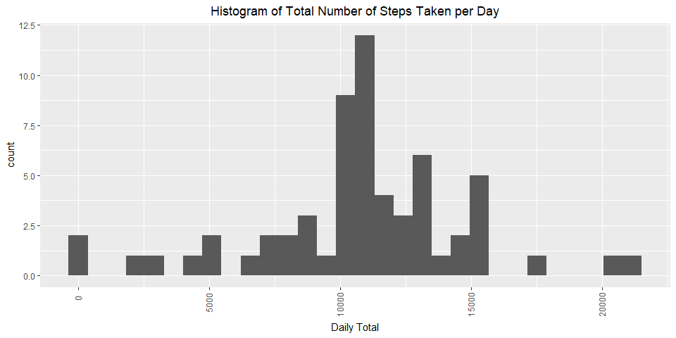
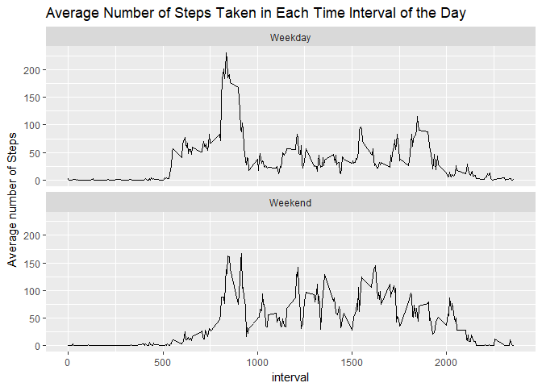

## Loading and preprocessing the data
You will need to have extracted the document activity.csv into a folder named activity.


```r
activity_data <- read.csv("./activity/activity.csv")
head(activity_data)
```

```
##   steps       date interval
## 1    NA 2012-10-01        0
## 2    NA 2012-10-01        5
## 3    NA 2012-10-01       10
## 4    NA 2012-10-01       15
## 5    NA 2012-10-01       20
## 6    NA 2012-10-01       25
```

```r
summary(activity_data)
```

```
##      steps                date          interval     
##  Min.   :  0.00   2012-10-01:  288   Min.   :   0.0  
##  1st Qu.:  0.00   2012-10-02:  288   1st Qu.: 588.8  
##  Median :  0.00   2012-10-03:  288   Median :1177.5  
##  Mean   : 37.38   2012-10-04:  288   Mean   :1177.5  
##  3rd Qu.: 12.00   2012-10-05:  288   3rd Qu.:1766.2  
##  Max.   :806.00   2012-10-06:  288   Max.   :2355.0  
##  NA's   :2304     (Other)   :15840
```


## What is mean total number of steps taken per day?

#### Daily Steps Distribution

```r
stepsByDate <- aggregate(activity_data$steps, by = list(date = activity_data$date), FUN = sum )

require(ggplot2)
ggplot(data = stepsByDate) + 
  geom_histogram(aes(x)) +
  labs(x = "Daily Total") + 
  theme(plot.title = element_text(hjust = 0.5), axis.text.x = element_text(angle = 90, hjust = 0.8, vjust = 0.4)) +
  ggtitle("Histogram of Total Number of Steps Taken per Day")
```

<!-- -->
#### Average Daily Steps

```r
mean(stepsByDate$x, na.rm = TRUE)
```

```
## [1] 10766.19
```

#### Median Daily Steps

```r
median(stepsByDate$x, na.rm = TRUE)
```

```
## [1] 10765
```


## What is the average daily activity pattern?

#### Time Series Plot

```r
stepsByInterval <- aggregate(activity_data$steps, by = list(interval = activity_data$interval), FUN = mean, na.rm = TRUE)
ggplot(stepsByInterval) +
  geom_line(aes(y = x, x = interval)) +
  labs(y = "Average number of Steps") +
  ggtitle("Average Number of Steps Taken in Each Time Interval of the Day")
```

<!-- -->

#### Peak Activity Period


```r
colnames(stepsByInterval)[2] <- "steps"
##this is the interval with the highest average number of steps
stepsByInterval[which.max(stepsByInterval$steps),]
```

```
##     interval    steps
## 104      835 206.1698
```
## Imputing missing values

#### Number of rows with Missing (NA) Values

```r
length(which(complete.cases(activity_data) == FALSE))
```

```
## [1] 2304
```

#### Filling in Blanks

```r
##Filling in missing "NA" values with the mean value for the interval.
newsteps <- merge(x = activity_data, y = stepsByInterval, by = "interval", all.x = TRUE)
newsteps$steps.x[is.na(newsteps$steps.x)] <- newsteps$steps.y[is.na(newsteps$steps.x)]
newsteps$steps.x <- as.integer(newsteps$steps.x)
newsteps <- newsteps[, 1:3]
colnames(newsteps)[2] <- "steps"
newsteps <- newsteps[, c(2,3,1)]
```

#### Daily Steps Distribution - NA's replaced with mean

```r
stepsByDate <- aggregate(newsteps$steps, by = list(date = newsteps$date), FUN = sum )

require(ggplot2)
ggplot(data = stepsByDate) + 
  geom_histogram(aes(x)) +
  labs(x = "Daily Total") + 
  theme(plot.title = element_text(hjust = 0.5), axis.text.x = element_text(angle = 90, hjust = 0.8, vjust = 0.4)) +
  ggtitle("Histogram of Total Number of Steps Taken per Day")
```

<!-- -->
#### Average Daily Steps

```r
mean(stepsByDate$x, na.rm = TRUE)
```

```
## [1] 10749.77
```

#### Median Daily Steps

```r
median(stepsByDate$x, na.rm = TRUE)
```

```
## [1] 10641
```
#### Results of Imputing Data
Increases the daily steps distribution for all

## Are there differences in activity patterns between weekdays and weekends?
#### Add a column indicating week or weekend

```r
newsteps$dayofweektype <- as.factor(
  ifelse(
    weekdays(as.POSIXlt( newsteps$date)) %in% c("Saturday", "Sunday"), 
    "Weekend", 
    "Weekday"
    )
  )
```

#### Steps per Interval - Weekdays vs Weekends 

```r
newstepsByInterval <- aggregate(newsteps$steps, by = list(interval = newsteps$interval, dayofweektype = newsteps$dayofweektype), FUN = mean, na.rm = TRUE)
ggplot(newstepsByInterval) +
  geom_line(aes(y = x, x = interval)) +
  labs(y = "Average number of Steps") +
  ggtitle("Average Number of Steps Taken in Each Time Interval of the Day") +
  facet_wrap(~dayofweektype, ncol = 1)
```

<!-- -->

